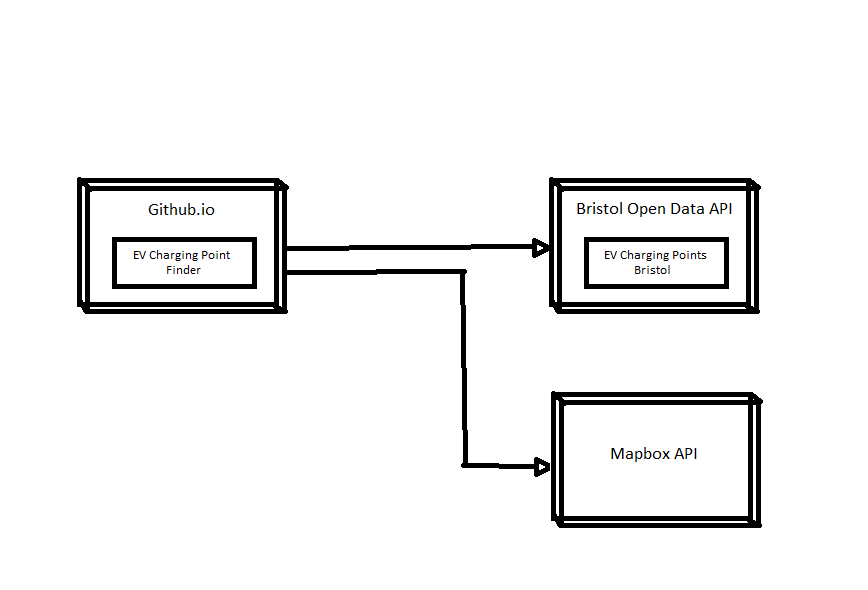
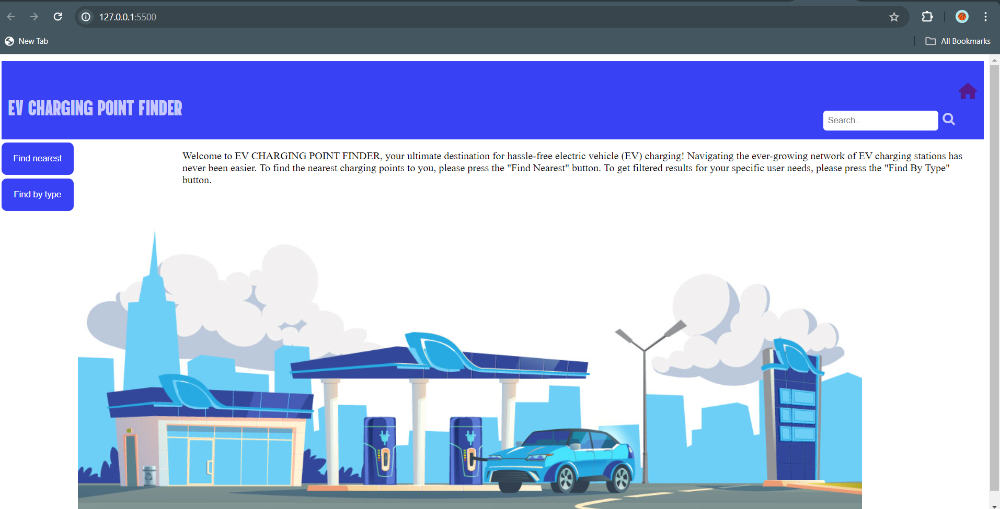
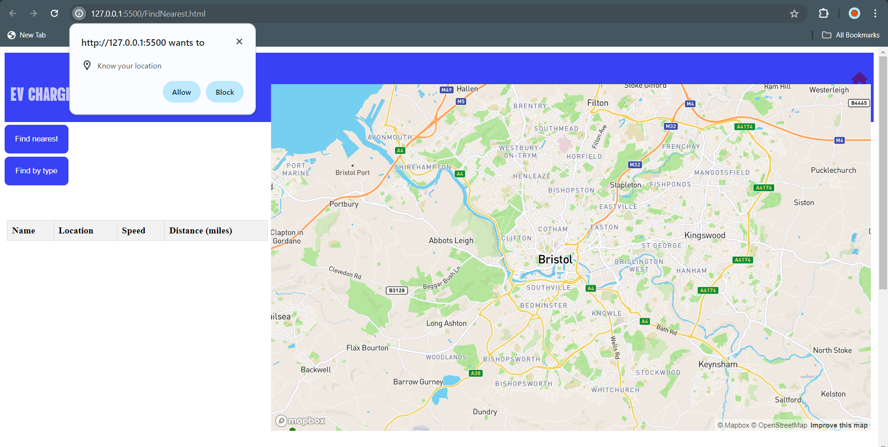
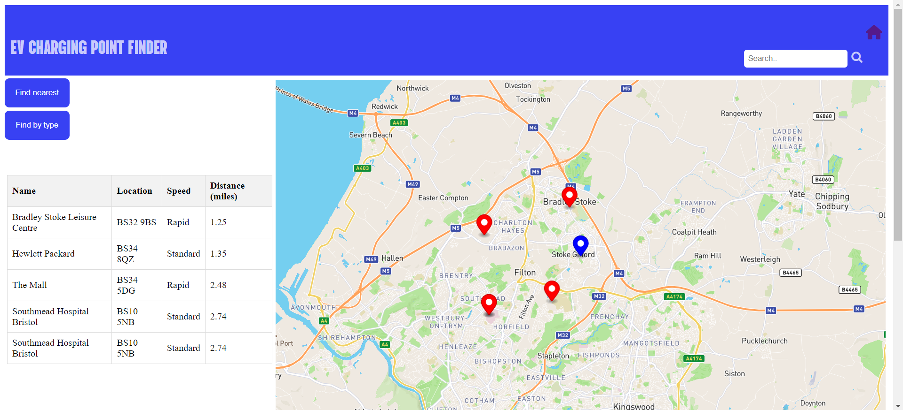

# Deployment

## Release Notes
In order for this application to remain functional, Bristol Open Data API and MapBox API must be abailable. If not the application will not operate correctly. The diagram below illustrates the relationship between the EV Charging Point Finder App and both Bristol Open Data and MapBox.

# User guide

### Use-Case 1

User enters app hitting landing page and reading instructions.  
 
 
 
User presses Find Nearest button and is navigated to new page where the app asks for permission to obtain the users location (UC1-FR1.4). 
 
 
 
Nearest EV charging points are displayed in table with user location pinned onto map. EV charging point locations are also displayed on the map with different coloured pins (UC1-FR1.1 UC1-FR1.2 UC1-FR1.3). 
 
 
 
 
### Use-Case 2
