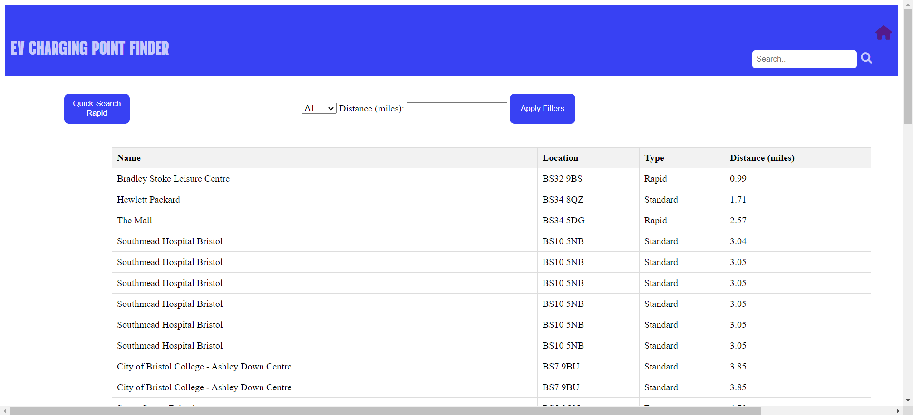
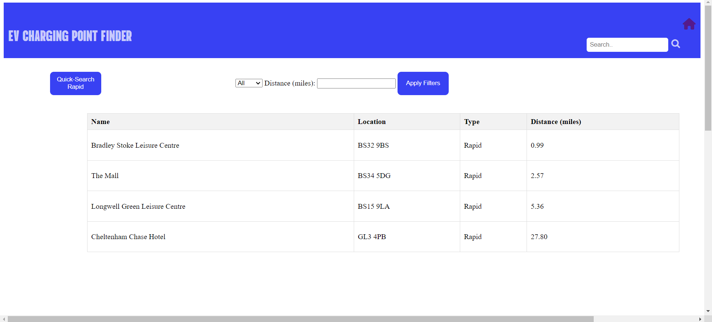
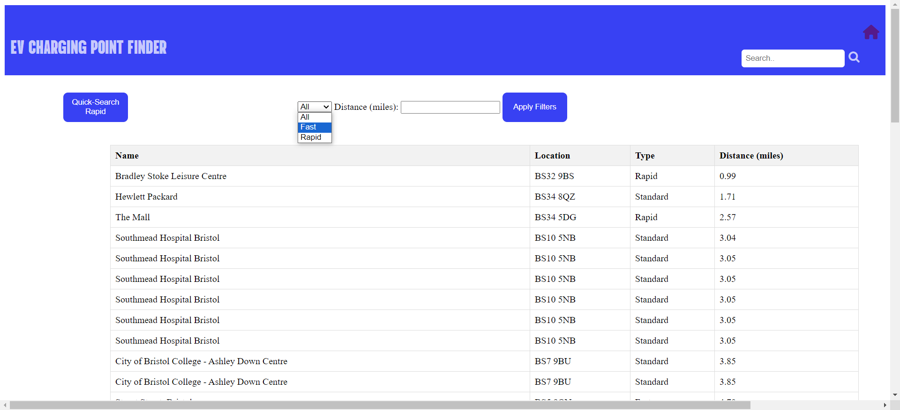
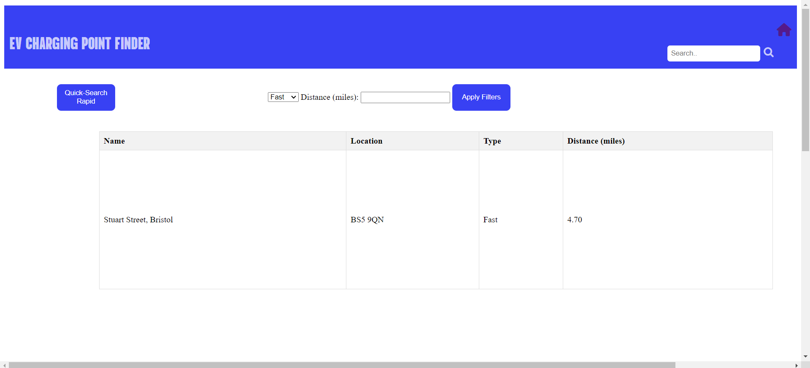
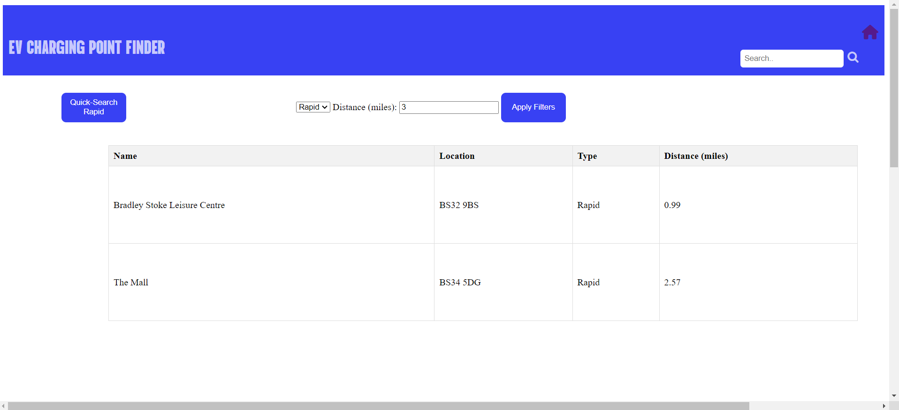

# Deployment

## Release Notes
In order for this application to remain functional, Bristol Open Data API and MapBox API must be abailable. If not the application will not operate correctly. The diagram below illustrates the relationship between the EV Charging Point Finder App and both Bristol Open Data and MapBox.

# User guide

### Use-Case 1 

User enters app hitting landing page and reading instructions.  
 
 
 
User presses Find Nearest button and is navigated to new page where the app asks for permission to obtain the users location (UC1-FR1.4). 
 
 
 
Nearest EV charging points are displayed in table with user location pinned onto map. EV charging point locations are also displayed on the map with different coloured pins (UC1-FR1.1 UC1-FR1.2 UC1-FR1.3). 
 
 
 
 
### Use-Case 2

User enters FindByType.html page and all EV charging points are displayed in a table in order of least distance from the user. (assumes that page has already saved the users preferences for sharing geolocation but if not geolocation will be requested in a similar manner to Use-Case 1) 
 
 
 
In order to quickly obtain only rapid charging points, user presses the "Quick-Search Rapid" button which instantly removes any non-rapid charging points from the table. Chargers are still listed in order of least distance from user.  
 
 
 

### Use-Case 3

User enters FindByType.html page and all EV charging points are displayed in a table in order of least distance from the user. (assumes that page has already saved the users preferences for sharing geolocation but if not geolocation will be requested in a similar manner to Use-Case 1) By selecting the filter, a drop down box appears for type including Fast. This is selected and the image below demonstrates the result. 
 
 
 
 
User can specify maximum distance to search for EV chargers at by inputing distance in miles (example below 3) in the filter box as shown... 
 
 
 
User can simultaneously filter for charger_type and distance as shown below... 
 
 

