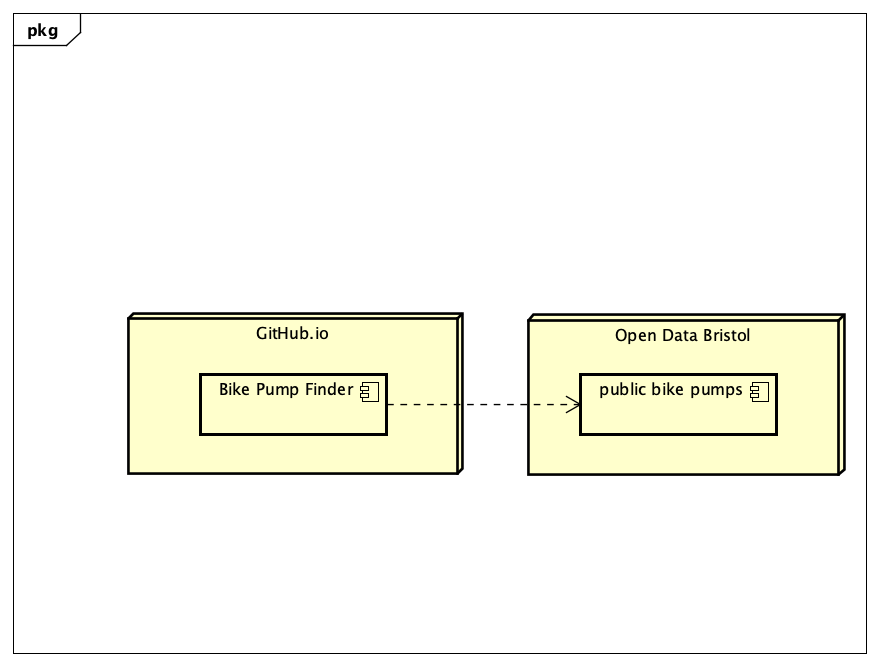

# Deployment

## Release Notes
TODO: Describe the current version of the system (with version number. Include system dependencies ands software tools used.
Are there any known issues? 
Describe the deployment of software components to hardware nodes using a UML Deployment diagram.
The functionality of this application depends on the Bristol Open Data API and MapBox API. If either of these services is unavailable, the application will not operate as intended. The Deployment Diagram depicted below illustrates the interaction of this web application with Bristol Open Data and MapBox.

# User guide
TODO: Explain how each use-case works by providing step-by-step screenshots for each use-case. This should be based on a tested scenario.

TODO: Repeat as necessary
