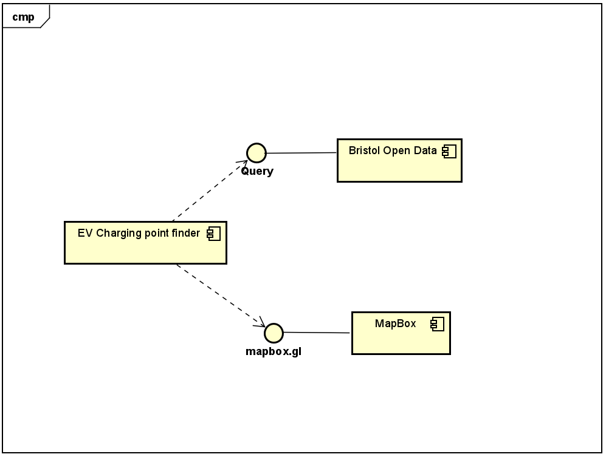

# Implementation

## Introduction

INDEX.html is the landing page and provides an entry point to the application along with a small description of the app and how to navigate it.
FindNearestCharger.html utilises Bristol Open Data API and the Mapbox API to pinpoint nearby electric vehicle charging points. It presents charging points in a table which features name, location, model, and energy.
FilterCharger.html collects user input to filter charger results. It asks for charger type, speed and availability then saves user input so what when "NEXT" is clicked the FilterByType.html page provides filtered charger results.
FilterByType.html uses the same method as FindNearestCharger and provides table of EV charging points; filtering out locations which are not to the users needs (as specified on the previous FilterCharger.html page).
The dataset is obtained from the Bristol Open Data API. Unecessary information regarding electric vehicle charging points are filtered out.

## Project Structure
In the "EVAPP" folder, INDEX.html is the landing page and provides an entry point to the application along with a small description of the app and how to navigate it. 
FindNearestCharger.html utilises Bristol Open Data API and the Mapbox API to pinpoint nearby electric vehicle charging points. It presents charging points in a table which features name, location, model, and energy. 
FilterCharger.html collects user input to filter charger results. It asks for charger type, speed and availability then saves user input so what when "NEXT" is clicked the FilterByType.html page provides filtered charger results. 
FilterByType.html uses the same method as FindNearestCharger and provides table of EV charging points; filtering out locations which are not to the users needs (as specified on the previous FilterCharger.html page). 
The corresponding css files are used to create a visually appealing and asthetic interface. The electric.jpg file is a background image for the INDEX.html landing page. 
<pre>
   EVAPP 
      ├── electric.jpg 
      ├── INDEX.html 
      ├── INDEXstyle.css 
      ├── FindNearest.html 
      ├── FindNearestStyle.css 
      ├── FilterPage.html 
      ├── FilterPageStyle.css 
      ├── FindByType.html 
      └── FindByTypeStyle.css 
      
</pre>

provide a table listing the number of jslint warnings/reports for each module.

## Software Architecture
The main app uses data from Bristol Open Data, and uses maps supplied by Mapbox. This is a service-orientated architecture.

## Bristol Open Data API
TODO: Document each query to Bristol Open Data

TODO: Repeat as necessary
