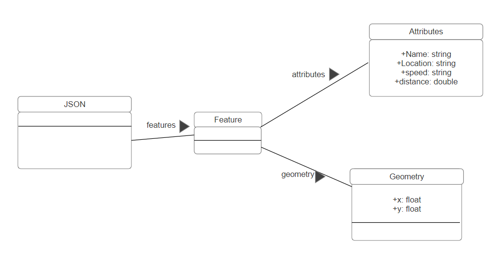

# Implementation

## Introduction
 
The system that is implemented for electric vehicle charging points in Bristol utillzes the data from bristol open data. The dataset includes information on 409 charging points in Bristol. Additionally details are provided some of which would prove useful to the user but many of which are not relevant such as device id, owner organisation name or device reference. This could prove problematic so EV charging point information is filtered via this application.
 

## Project Structure
In the "EVAPP" folder, there are various .html and .css files which are listed below: 
 
Index.html is the landing page and provides an entry point to the application along with a small description of the app and how to navigate it. 
 
FindNearestCharger.html utilises Bristol Open Data API and the Mapbox API to pinpoint nearby electric vehicle charging points. It presents charging points in a table which features name, location, model, and energy. 
 
FilterCharger.html collects user input to filter charger results. It asks for charger type, speed and availability then saves user input so what when "NEXT" is clicked the FilterByType.html page provides filtered charger results. 
 
FilterByType.html uses the same method as FindNearestCharger and provides table of EV charging points; filtering out locations which are not to the users needs (as specified on the previous FilterCharger.html page). 
 
The StyleSheet.css file is used to create a visually appealing and asthetic interface. The electric.jpg file is a background image for the Index.html landing page. 
<pre>
   EVAPP 
      ├── electric.jpg 
      ├── Index.html 
      ├── FindNearest.html 
      ├── FilterPage.html 
      ├── FindByType.html 
      └── StyleSheet.css 
      
</pre>

provide a table listing the number of jslint warnings/reports for each module.

## Software Architecture
The main app uses data from Bristol Open Data, and uses maps supplied by Mapbox. This is a service-orientated architecture.

## Bristol Open Data API
FindNearest.hmtl makes two requests to the Bristol Open Data API. First, in the fetchChargerData() function, it retrieves charging point data based on the user's location. Then, within sortChargerDataByDistance(), it calculates distances between each charger and the user, sorting and displaying the nearest ones.

FindByType.html sends two requests to the Bristol Open Data API. Firstly, in the fetchChargerData() function, it retrieves charging point data based on the user's geolocation. Then, within applyFilters(), it filters the chargers based on user-defined criteria and displays the nearest ones on the map and in the table. These queries ensure that users receive accurate and relevant information about nearby charging stations. 

### UML DIAGRAM

