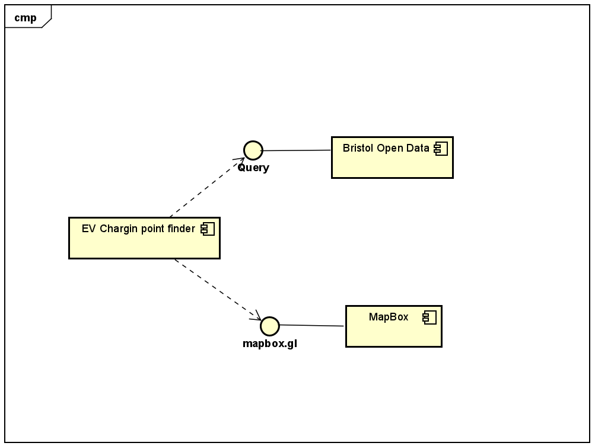

# Implementation

## Introduction
TODO: Describe the system implemented (Describe the dataset. Are there any known issues? Describe any configuration data).

## Project Structure
TODO: Provide an outline of the project folder structure and the role of each file within it.
provide a table listing the number of jslint warnings/reports for each module.
The main app is directed in the app folder. The index.html is the splash page. An experimental early version of the of the prototype can be found in the prototype folder.
├── app
│   ├── FindByDistance.html
│   ├── Index.html
│   └── FindByType.html
│   ├── script.js
│   └── StyleSheet.css
├── prototype
├── test
└── readme.md

## Software Architecture
TODO: Describe the major components of your architecture. Are any particular architectural styles being used?

## Bristol Open Data API
TODO: Document each query to Bristol Open Data

TODO: Repeat as necessary
