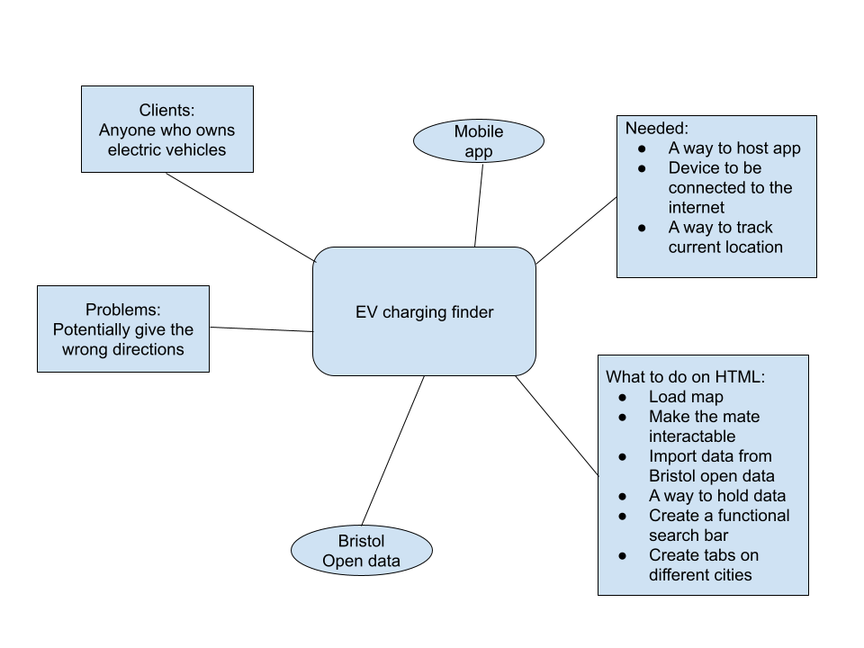

# Electric Vehical Charging Point App

## Business Case

### Problem statement
The electric vehical drivers constantly need to know where the nearest public charging point is. The app tackles this problem by using a drivers locations and finding the nearest charging point to the user. It will also take into account price and maximum charging time. 

### Business benefits
This product will provide electric vehicle drivers an easy way to keep their vehicles charged and make long journeys without the risk of finding themselves too far from the nearest charging point. 
### Options Considered
Google maps, basic internet use

### Expected Risks
Lack of charging infrastructure charging points are few and far between

## Project Scope
GitHub Version Control allows you to keep track of the progress of the project and revert back to old versions if needed.  
Mobile style app allows people to find electric vehicle charging points on the go making it more convienient.  
Bristol Open Data API for the data set used in the app.  

