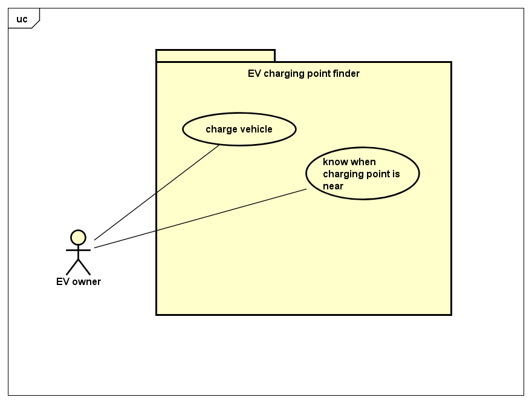

# Requirements

## User Needs

### User stories

    As an electric vehicle driver I want to use an app so that I can locate the nearest charging point
    As an electric vehicle driver I want to know when I am near a electric vehicle charging point so that I can charge my vehicle

### Actors

Electric vehical driver: Someone who both owns and drives a vehicle powered by electricity

### Use Cases

|   UC1        | Locate nearest EV charging point | 
| -------------------------------------- | ------------------- |
| **Description** | Locate the nearest EV charging point to driver. |
| **Actors** |   Electric vehical driver |
| **Assumptions** |  Browser has geo locqtion</td></tr>
| **Steps** |      1. View table of EV charging points
|           |      2. Ask user for persmission to access their location
|           |      3. Give permission for geo-location
|           |      4. Retrieve nearest EV charging points from the database
|           |      5. View table of nearest EV charging points
| **Variations** | TODO: OPTIONAL - Any variations in the steps of a use case |
| **Non-functional** | TODO: OPTIONAL - List of non-functional requirements that the use case must meet. |
| **Issues** | TODO: OPTIONAL - List of issues that remain to be resolved |

|   UC2        | Show all nearby EV charging points in a list according to distance from user | 
| -------------------------------------- | ------------------- |
| **Description** | TODO: Locate the nearest EV charging point to driver. |
| **Actors** | TODO: Electric vehical driver |
| **Assumptions** | TODO: Browser has geo locqtion</td></tr>
| **Steps** |      1. View table of EV charging points
|           |      2. Ask user for persmission to access their location
|           |      3. Give permission for geo-location
|           |      4. Retrieve nearest EV charging points from the database
|           |      5. View table of nearest EV charging points
| **Variations** | TODO: OPTIONAL - Any variations in the steps of a use case |
| **Non-functional** | TODO: OPTIONAL - List of non-functional requirements that the use case must meet. |
| **Issues** | TODO: OPTIONAL - List of issues that remain to be resolved |

## Software Requirements Specification
### Functional requirements

FR1 indicates UC1 and FR2 indicates UC2

FR2.1 The system should be able to collect the data of where the EV charging points are from Open Data Bristol

FR2.2 The system should ask/obtain permission from the user to access their location or have the user input a location

FR2.3 The system should display both user location and EV charging point locations using different respective markers

FR2.4 The system should display the distances between the user location and EV charging point locations

FR2.5 The system should list all the EV charging point locations in a list displaying the distances to them

### Non-Functional Requirements
TODO: Consider one or more [quality attributes](https://en.wikipedia.org/wiki/ISO/IEC_9126) to suggest a small number of non-functional requirements.
Give each non-functional requirement a unique ID. e.g. NFR1, NFR2, ...

Indicate which UC the requirement comes from.
