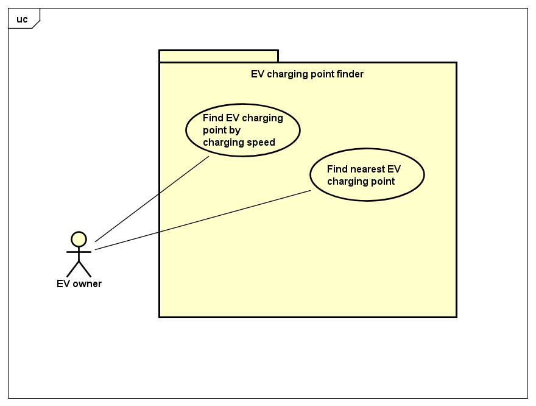

# Requirements

## User Needs

### User stories

    As an electric vehicle driver I want to use an app so that I can locate the nearest charging point
    As an electric vehicle driver I want to be able to locate a rapid or superfast electric vehicle charging point so that I can charge my vehicle more quickly

### Actors

Electric vehical driver: Someone who both owns and drives a vehicle powered by electricity

### Use Cases

|   UC1        | Show all nearby EV charging points in a list according to distance from user | 
| -------------------------------------- | ------------------- |
| **Description** | Locate the nearest EV charging point to driver. |
| **Actors** |   Electric vehical driver |
| **Assumptions** |  Browser has geo location</td></tr>
| **Steps** |      1. View table of EV charging points
|           |      2. App asks user for persmission to access their location
|           |      3. User gives permission for geo-location
|           |      4. App retrieves nearest EV charging points from the database
|           |      5. App displays table of nearest EV charging points in order of least distance from user
| **Variations** |                                           |
| **Non-functional** |                                       |
| **Issues** |                                               |

|   UC2        | Locate nearest rapid and superfast charging points near user | 
| -------------------------------------- | ------------------- |
| **Description** | Locate nearest rapid and superfast charging points near user |
| **Actors** | Electric vehical driver |
| **Assumptions** |  Browser has geo location</td></tr>
| **Steps** |      1. User selects rapid charging points
|           |      2. App asks user for persmission to access their location
|           |      3. User gives permission for geo-location
|           |      4. App retrieve nearest EV super fast charging points from the database
|           |      5. App displays these in a table in order of least distance from user
| **Variations** |                                            |
| **Non-functional** |                                        |
| **Issues** |                                                |

## Software Requirements Specification
### Functional requirements

FR1 indicates UC1 and FR2 indicates UC2

FR1.1 The system should be able to collect the data of where the EV charging points are from Open Data Bristol 
FR1.2 The system should ask/obtain permission from the user to access their location or have the user input a location 
FR1.3 The system should list all the EV charging point locations in a list displaying the distances to them 

FR2.1 The system should be able to distinguish between standard charging points and superfast/rapid charging points
 

### Non-Functional Requirements

NFR1.1: The previously inputted location by the user should be saved in a secure and encrypted location (Security) 
NFR1.2: The app should work on a standard iPhone or android phone screen, but also fit to PC screens (Portability) 
NFR1.3: The app should be quick to respond to the user's requests (Performance efficiency) 
NFR1.4: The app should also work on website browsers (Compatibility) 
NFR1.5: Data should be regularly checked and updated (Functional suitability)
